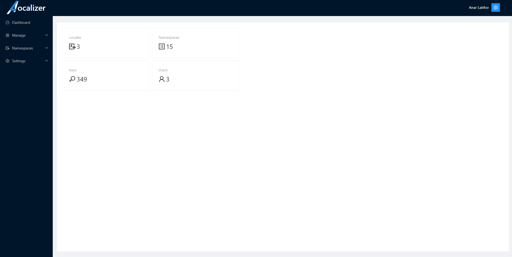
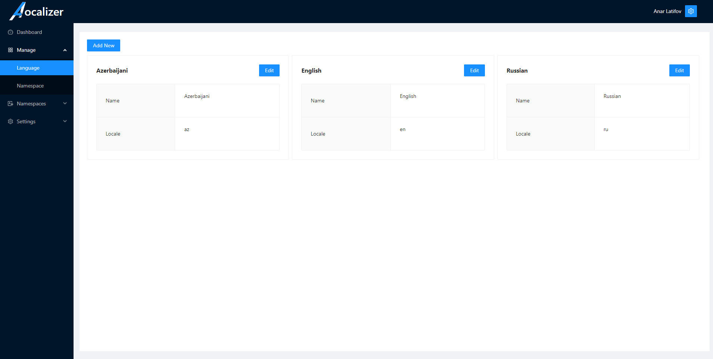
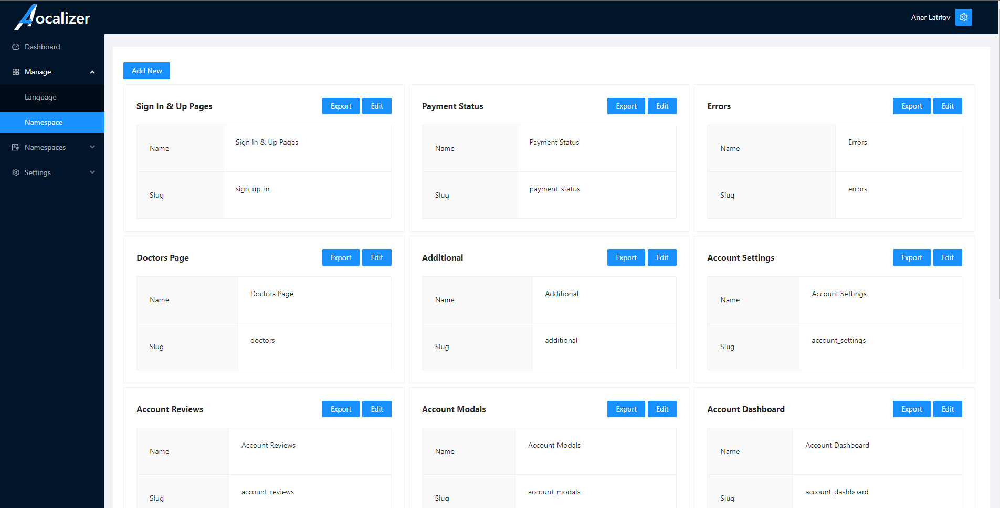
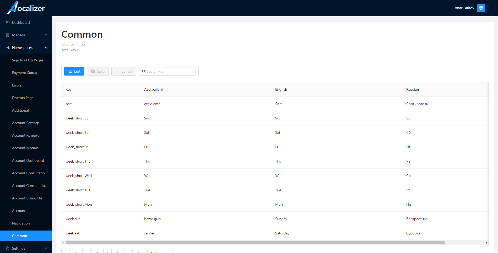
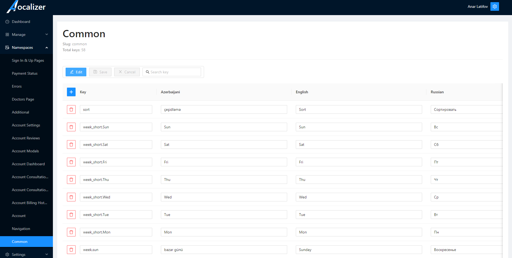
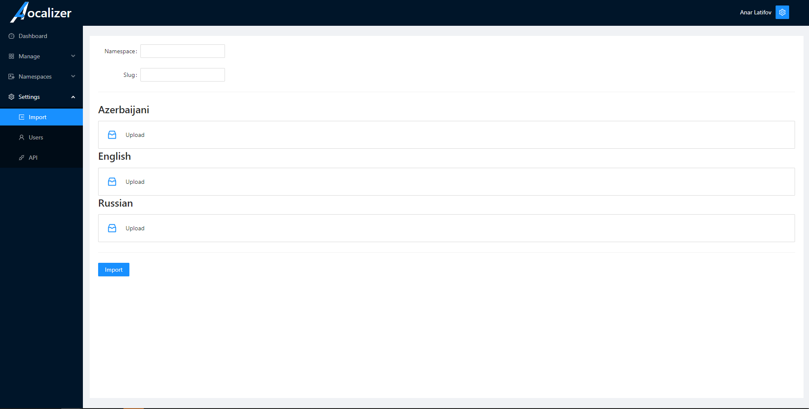
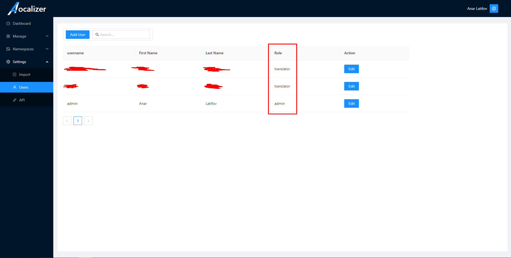

[![Contributors][contributors-shield]][contributors-url]
[![Forks][forks-shield]][forks-url]
[![Stargazers][stars-shield]][stars-url]

 

  

  <h3 align="center">A-Localizer</h3>

  

    A tool to manage i18n-next locales.
     
    <a href="https://github.com/jokopain/a-localizer"><strong>Explore the docs »</strong></a>
     
     
    <!-- <a href="https://github.com/jokopain/a-localizer">View Demo</a> 
    ·-->
    <a href="https://github.com/jokopain/a-localize/issues">Report Bug</a>
    ·
    <a href="https://github.com/jokopain/a-localizer/issues">Request Feature</a>
  

I builded it in less than one week, so some parts of code is peace of ... =) 

### Built With

This section should list any major frameworks/libraries used to bootstrap your project. Leave any add-ons/plugins for the acknowledgements section. Here are a few examples.

* [React.js](https://reactjs.org/)
* [Sequelize](https://sequelize.org/)
* [Express](https://expressjs.com/)
* [Ant Design](https://ant.design/)

(<a href="#top">back to top</a>)

<!-- Examples -->
## Examples

### Dashboard

See the status of localizations

### Manage
Manage your languages/locales
 

and namespaces, also you always can export it!
 

### Namespaces/Keys
Find keys, and edit them
 
 

### Settings
Import already exist namespaces from i18n-next in json format 
 

Mange your users, add edit them and also you have 2 roles
 

<!-- CONTRIBUTING -->
## Contributing

Contributions are what make the open source community such an amazing place to learn, inspire, and create. Any contributions you make are **greatly appreciated**.

If you have a suggestion that would make this better, please fork the repo and create a pull request. You can also simply open an issue with the tag "enhancement".
Don't forget to give the project a star! Thanks again!

1. Fork the Project
2. Create your Feature Branch (`git checkout -b feature/AmazingFeature`)
3. Commit your Changes (`git commit -m 'Add some AmazingFeature'`)
4. Push to the Branch (`git push origin feature/AmazingFeature`)
5. Open a Pull Request

(<a href="#top">back to top</a>)

[contributors-shield]: https://img.shields.io/github/contributors/jokopain/a-localizer.svg?style=for-the-badge
[contributors-url]: https://github.com/jokopain/a-localizer/graphs/contributors
[forks-shield]: https://img.shields.io/github/forks/jokopain/a-localizer.svg?style=for-the-badge
[forks-url]: https://github.com/jokopain/a-localizer/network/members
[stars-shield]: https://img.shields.io/github/stars/jokopain/a-localizer.svg?style=for-the-badge
[stars-url]: https://github.com/jokopain/a-localizer/stargazers
